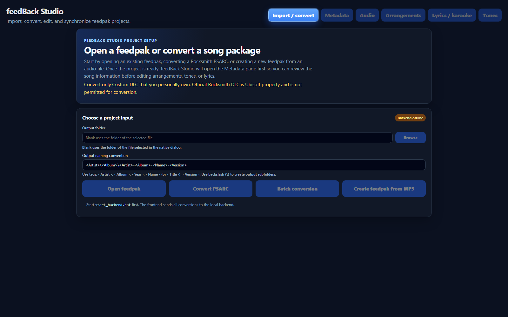
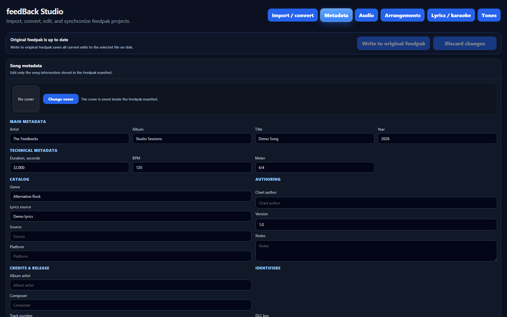
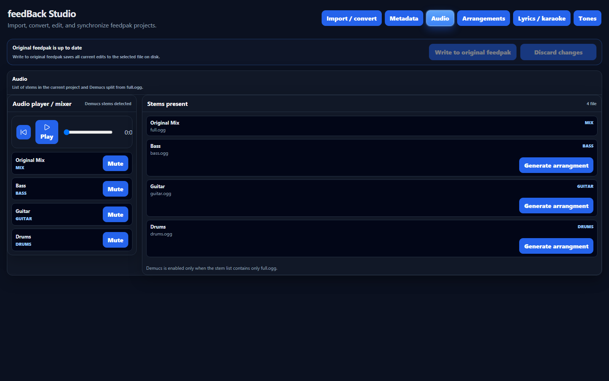
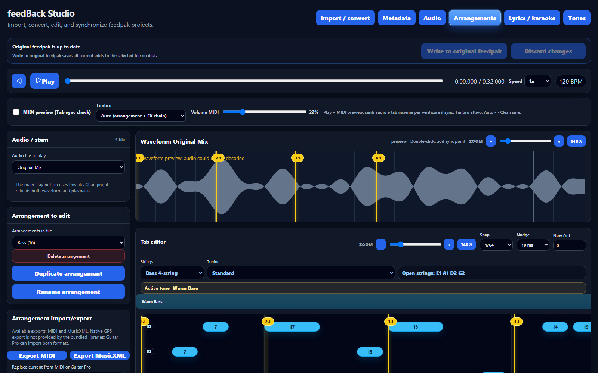
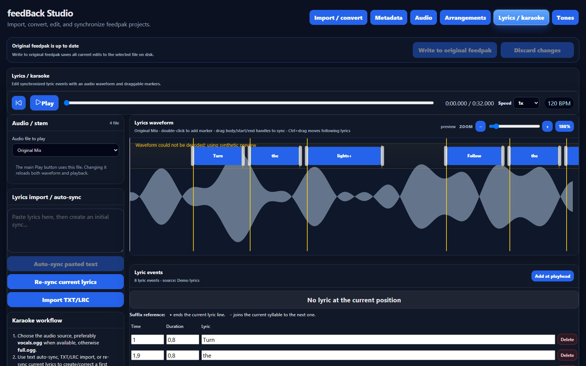
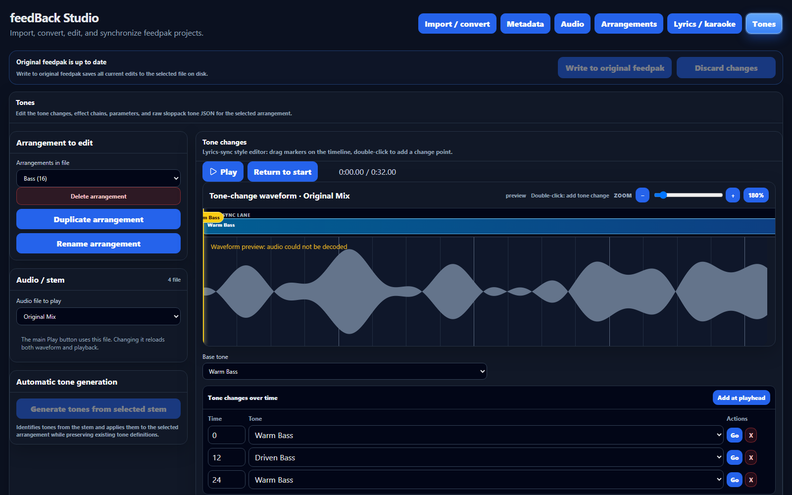

# feedBack Studio

feedBack Studio is a local web editor for feedpak projects, Rocksmith PSARC imports, MP3/audio-to-feedpak conversion, tablature editing, score viewing, tone chains, stems, and audio synchronization.

> Disclaimer: convert only Custom DLC that you personally own. Official Rocksmith DLC is Ubisoft property and is not permitted for conversion.

## Start the app

### Desktop app (recommended)

```powershell
start_desktop.bat
```

This builds the frontend, starts the backend, and opens feedBack Studio in a native desktop window.

### Frontend + backend (development)

```powershell
start_backend.bat
start_frontend.bat
```

Then open the Vite URL shown in the frontend terminal, usually:

```text
http://localhost:5173
```

### Manual backend start

```powershell
cd backend
py -3.11 -m venv .venv
.venv\Scripts\python.exe -m pip install -r requirements.txt
.venv\Scripts\python.exe setup_tools.py
.venv\Scripts\python.exe -m uvicorn app.main:app --reload --port 8000
```

Using the virtual-environment interpreter explicitly avoids depending on a globally configured `pip` or `uvicorn` command.

### Manual frontend start

```powershell
npm install
npm run dev
```

Check the backend health endpoint at:

```text
http://localhost:8000/api/health
```

## Requirements

- Windows is recommended for the bundled helper-tool workflow.
- Node.js LTS.
- Python 3.11 is required for the backend and desktop launcher.
- Internet connection on first backend setup so `setup_tools.py` can download local helper tools.

## Main features

- Open existing `.feedpak` or `.zip` feedpak packages.
- Convert `.psarc` packages to feedpak.
- Create a feedpak from `.mp3`, `.wav`, `.flac`, `.m4a`, or `.ogg`.
- Optional Demucs stem separation during import or conversion.
- Automatic `full.ogg` creation when stem separation is disabled.
- Automatic MP3/audio synchronization using beat tracking.
- PSARC synchronization using imported `ebeats` when available.
- Metadata editing for artist, album, title, year, cover art, technical fields, and references.
- Arrangement editing with waveform, sync points, tab/piano roll, score view, and tone chains.
- Import, replace, and export arrangements as MIDI or MusicXML.
- Lyrics / karaoke editing with waveform markers, advanced pasted-text alignment, re-sync, transcription, and job progress.
- Tone editing with automatic stem-based tone identification, an audio waveform, integrated tone-sync lane, zoomable timing markers, effect chains, graphical gear controls, text parameters, and raw JSON.
- Safe save workflow with one explicit write-to-original action.

## Menu workflow

The top-right menu follows the main editing flow in this order:

1. **Import / convert**

   

   - Open an existing feedpak.
   - Convert a Rocksmith PSARC.
   - Create a feedpak from an audio file.
   - This is the startup page and the entry point for a new project.

2. **Metadata**

   

   - Edit artist, album, title, year, cover art, technical metadata, lyrics source, chart author, version, notes, and custom references.
   - Use **Back to editor** to return to arrangement editing.

3. **Audio**

   

   - Select the project audio source and control playback, volume, mute, and solo for every available stem.
   - Review the stems stored in the current feedpak and generate compatible guitar, bass, drum, or lyric arrangements.
   - Run Demucs separation when the project contains only the full mix.

4. **Arrangements**

   

   - Work on arrangements, sync points, waveform, tab/piano roll, score view, and tone chains.
   - Use the arrangement selector for import/export controls.
   - Replace the current arrangement from MIDI or Guitar Pro.
   - Export the selected arrangement as MIDI or MusicXML.
   - Editor changes remain pending until **Write to original feedpak** is used.

5. **Lyrics / karaoke**

   

   - Edit synced lyric markers directly on the waveform.
   - Use **Auto Sync pasted text** to align the exact pasted lyrics with recognized word timing. The synchronizer tries the available detailed timing sources before using the vocal-region fallback, while preserving readable line breaks.
   - Use **Resync current lyrics** to run the same advanced alignment on the lyrics already loaded in the editor.
   - The page shows the current step and percentage while recognition, pasted-text sync, or re-sync is running.
   - Use **Recognise lyrics** to transcribe and synchronize from audio. Running it again replaces the current lyric text and synchronization with the newly recognized result; save the current version first if it must be retained.
   - Lyrics changes are saved together with the project by **Write to original feedpak**.

6. **Tones**

   

   - Select the arrangement and audio source, then edit tone changes and the effect chain for the active arrangement.
   - Use **Generate tones from selected stem** to analyze a compatible stem and create or refresh tone definitions automatically.
   - Use **Delete tone** to remove a definition and its references from the arrangement when needed.
   - Edit tone timing directly on the waveform and tone-sync lane, then adjust gear and effect parameters in the text editor or graphical controls.
   - Tone changes are saved together with the project by **Write to original feedpak**.

## Save model

feedBack Studio exposes one explicit save action: **Write to original feedpak**. Editors update the current project state, and this action persists metadata, arrangements, lyrics, tones, and synchronization together to the selected original/final feedpak. **Discard changes** reloads the package from disk without saving the pending edits.

The internal editable copy stays under `backend/workspace/projects` and is never created beside the source file.

## Native tools

`requirements.txt` installs Python dependencies only. Native tools are handled by `backend/setup_tools.py`:

- ffmpeg is provided through `imageio-ffmpeg`.
- vgmstream-cli is downloaded into `backend/tools/vgmstream`.
- SNG parsing and conversion use the bundled Python modules.

## Feedpak metadata

feedBack Studio stores first-class song metadata in the feedpak manifest:

```yaml
artist: Artist
album: Album
title: Song Title
year: 2024
duration: 245.3
bpm: 120
meter: [4, 4]
metadata:
  genre: Rock
  lyricsSource: xml
  charter: ...
  version: 1.0
  notes: ...
```

The metadata editor updates core manifest fields and preserves supported non-core scalar references under `metadata`.

## Tone model

Tone data is read and saved according to the feedpak structure:

```json
{
  "base": "Clean",
  "changes": [
    { "t": 35.2, "name": "Lead" }
  ],
  "definitions": [
    { "Name": "Clean", "GearList": [] }
  ]
}
```

The chain reads and writes `tones.definitions[].GearList`. The raw JSON editor modifies the same tone definition. Effect parameters are detected from `Parameters`, `parameters`, `Params`, `params`, `KnobValues`, `knobValues`, `Knobs`, or `knobs` so imported feedpaks can retain their original schema.

The tone-change waveform renders the tone segments in an integrated lane above the audio. Both layers use the same content width, zoom, horizontal scrolling, and time-to-pixel conversion, preventing timing differences between the lane and waveform.

The effect chain itself keeps its compact text-based layout. Clicking an effect opens a separate graphical drawer for that component; it does not permanently replace or resize the standard editor. Changes made with a graphical knob, fader, or switch are written back to the same effect parameter object used by the text editor.

## Artwork and lyrics

feedBack Studio preserves album artwork and synced lyrics when they are present in an imported PSARC or feedpak. MP3, FLAC, M4A, and OGG imports also try to read embedded artwork and unsynced lyrics from audio tags.

The metadata view includes an album-art preview with controls to add, replace, or remove the cover. The cover is stored through the feedpak manifest `cover` field.

Lyrics are edited on the dedicated **Lyrics / karaoke** page with waveform markers, precise timing controls, and optional transcription.

## Legal, licensing, and attribution

feedBack Studio is distributed under the [GNU Affero General Public License v3.0 only](LICENSE) (`AGPL-3.0-only`). Copyright (C) 2026 feedBack Studio contributors. This repository contains modifications and new work created for feedBack Studio in 2026.

feedBack Studio incorporates and adapts libraries and source code from the independent open-source project [got-feedBack/feedBack](https://github.com/got-feedback/feedBack). The original feedBack code and contributions remain copyright of their respective authors and are provided under the [GNU Affero General Public License v3.0 only (AGPL-3.0-only)](https://github.com/got-feedback/feedBack/blob/main/LICENSE). The upstream project also identifies its license as AGPL-3.0-only.

Use, modification, distribution, and network deployment of feedBack-derived code must comply with the AGPL-3.0-only terms. In particular, when a covered or modified version is distributed, or made available for users to interact with over a network, the corresponding source code and applicable copyright and license notices must be made available as required by that license. Third-party libraries, native tools, media, and plugins retain their own copyright and license terms; their inclusion does not transfer ownership or grant rights beyond their respective licenses.

feedBack Studio is an independent project and is not endorsed by, sponsored by, or affiliated with the got-feedBack/feedBack maintainers, Ubisoft Entertainment, or the owners of any referenced games, products, trademarks, audio, artwork, tablature, or downloadable content. Rocksmith, Ubisoft, and other names or marks are the property of their respective owners and are used only for identification and interoperability.

This software does not provide or grant rights to copyrighted songs, official DLC, artwork, tablature, or other third-party content. Users are responsible for ensuring that they own the content they process or have all permissions required by applicable law. Do not use this software to copy, decrypt, distribute, or convert official or otherwise protected content without authorization.

The software is provided **as is**, without warranty of any kind, subject to the warranty and liability provisions of the applicable licenses. This section is an attribution and compliance notice, not legal advice; distributors and hosted-service operators remain responsible for reviewing and satisfying all applicable license and legal obligations.

## Notes

- Bundled libraries in `backend/lib` are used as local dependencies and are not modified.
- The browser does not directly convert PSARC, run Demucs, or write arbitrary disk folders; the local FastAPI backend does that work.
- Native GP5 export is not implemented because the included libraries provide import/conversion helpers rather than a safe GP5 writer. Use MIDI or MusicXML for export to Guitar Pro.
